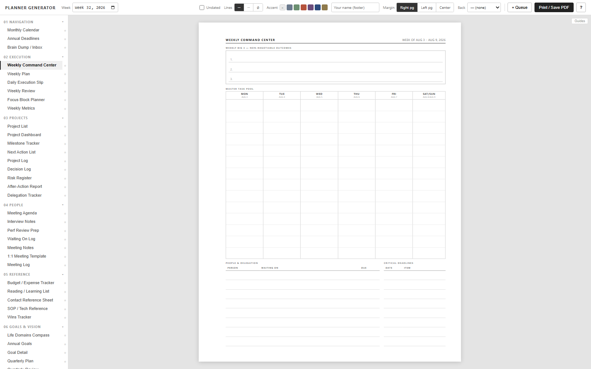

# Planner Generator

A free, single-page web app for generating **printable paper planner pages** — daily execution slips,
weekly command centers, project dashboards, meeting notes, habit trackers and more. Pick a page type,
set the date or project, print it or save it as a PDF.

**→ [Open the planner generator](https://aaldrich29.github.io/planner-generator/)**

No install, no account, and your planner content never leaves your browser. It's one HTML file with no
dependencies — save it locally and it works offline forever.



## How it works

1. **Pick a page** from the left sidebar.
2. **Set the parameters** in the top bar — the controls change per page (date, week, project name,
   schedule range, task count…). The preview updates as you type.
3. **Print it** with *Print / Save PDF* — or click *+ Queue* to stack up several pages and print
   them in a single job.

Pages are letter size (8.5″ × 11″). In your browser's print dialog set margins to **None** and scale
to **100%**.

## What's included

| Section | Pages |
|---|---|
| **01 Navigation** | Monthly Calendar, Annual Deadlines, Brain Dump / Inbox |
| **02 Execution** | Weekly Command Center, Weekly Plan, Daily Execution Slip, Weekly Review, Focus Block Planner, Weekly Metrics |
| **03 Projects** | Project List, Project Dashboard, Milestone Tracker, Next Action List, Project Log, Decision Log, Risk Register, After-Action Report, Delegation Tracker |
| **04 People** | Meeting Agenda, Interview Notes, Perf Review Prep, Waiting On Log, Meeting Notes, 1:1 Template, Meeting Log |
| **05 Reference** | Budget / Expense Tracker, Reading List, Contact Reference, SOP / Tech Reference, Wins Tracker |
| **06 Goals & Vision** | Life Domains Compass, Annual Goals, Goal Detail, Quarterly Plan, Quarterly Review, Ideal Week, Someday / Maybe |
| **07 Relationships** | Relationship Roster, Person Profile, Relationship Log, Relationship Planner |
| **Extras** | Travel / Event Planner, Health / Energy Log, Divider / Section Tab, Habit Tracker, Notes Page, Bible Reading Plan |

## Features

- **Print queue** — build a multi-page batch, drag to reorder, save it as a reusable preset.
- **Binder margins** — per-page left / right / center binding margin, so pages sit correctly in a
  two-sided binder. Optional duplex backs: blank, notes, notes pre-stamped with the front page's
  date, or a duplicate of the front.
- **Customization** — accent color, ruled / dotted / blank lines, your name in the footer.
- **Favorites** — star the pages you use weekly to pin them to the top.
- **Local only** — preferences and saved queues live in your browser's localStorage. There is no
  backend and nothing you type is ever transmitted. The hosted copy loads
  [GoatCounter](https://www.goatcounter.com/) for anonymous page-view counts (no cookies, no
  cross-site tracking); a locally saved copy makes no network requests at all.

## Running it yourself

Clone the repo and open `index.html` in any modern browser. That's the whole build process.

```bash
git clone https://github.com/aaldrich29/planner-generator.git
```

## License

MIT — see [LICENSE](LICENSE).
